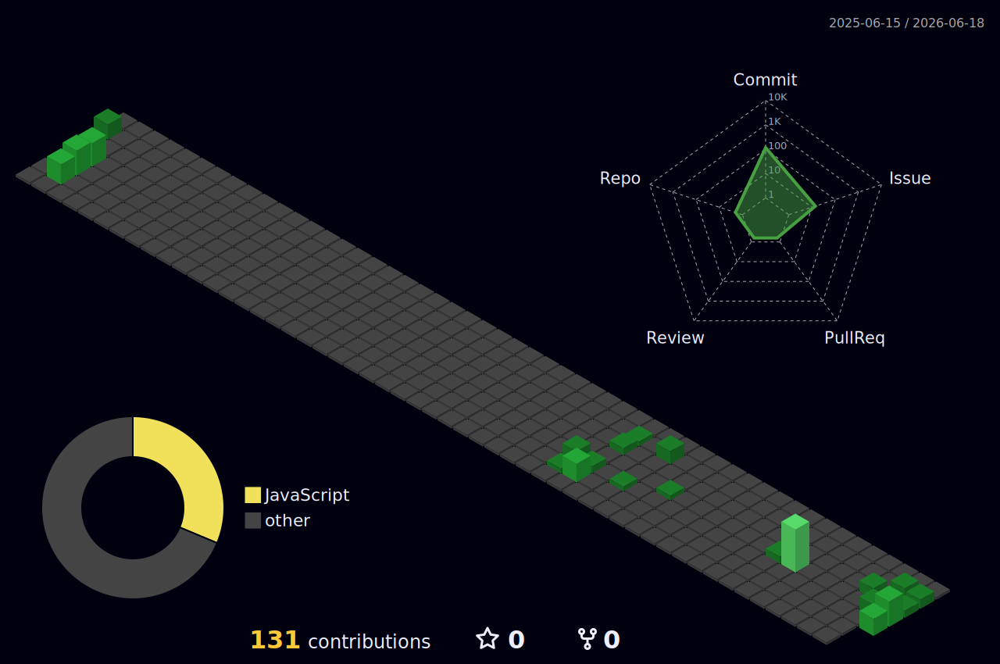

<h1 align="center">Hi 👋, I'm Natan</h1>

## 👋 About me

Sou um desenvolvedor Full Stack com experiência em desenvolvimento web, e automação de processos. Gosto de transformar ideias em soluções funcionais com foco em performance e boas práticas.

## 🛠️ My favorite tools and technologies ⚙️

> Tools and technologies that I have worked with and am interested in

<table>
  <tr>
    <td align="center" width="96">
        
       C#
    </td>
    <td align="center" width="96">
      
       Python
    </td>
    <td align="center" width="96">
        
       Javascript
    </td>
    <td align="center" width="96">
        
       C++
    </td>
    <td align="center" width="96">
        
       Github
    </td>
    <td align="center" width="96">
        
       Rest API
    </td>
  </tr>
  <tr>
    <td align="center" width="96">
        
       Git
    </td>
    <td align="center" width="96">
        
       HTML
    </td>
    <td align="center" width="96">
        
       CSS
    </td>
    <td align="center" width="96">
        
       PostgreSQL
    </td>
    <td align="center" width="96">
        
       React
    </td>
    <td align="center" width="96">
        
       Angular
    </td>
  </tr>
  <tr>
    <td align="center" width="96">
        
       Postman
    </td>
    <td align="center" width="96">
        
       Node.js
    </td>
  </tr>
</table>

## 📊 Estatísticas do GitHub

  

## 📚 Certificações e Cursos

- [Alura] Formação JavaScript Full Stack (2024)
- [Rocketseat] Discover + Explorer (2023)
- [AWS] Fundamentos de Cloud AWS (em andamento)

## ✨ Curiosidades

- 🔍 Gosto de resolver desafios no HackerRank e Codewars
- 📖 Estudo sobre clean code e arquitetura de software
- 🎮 Curto jogos cooperativos e desenvolvimento de games

## 📈 Minhas Estatísticas

## 🎯 Objetivo Profissional

Busco oportunidades como desenvolvedor backend ou DevOps, onde eu possa aplicar meus conhecimentos em automação, APIs e infraestrutura como código.

## 🌱 Atualmente estou estudando

- Docker e Kubernetes
- Arquitetura de microsserviços
- AWS com foco em DevOps

## Meus projetos

  

  

  

