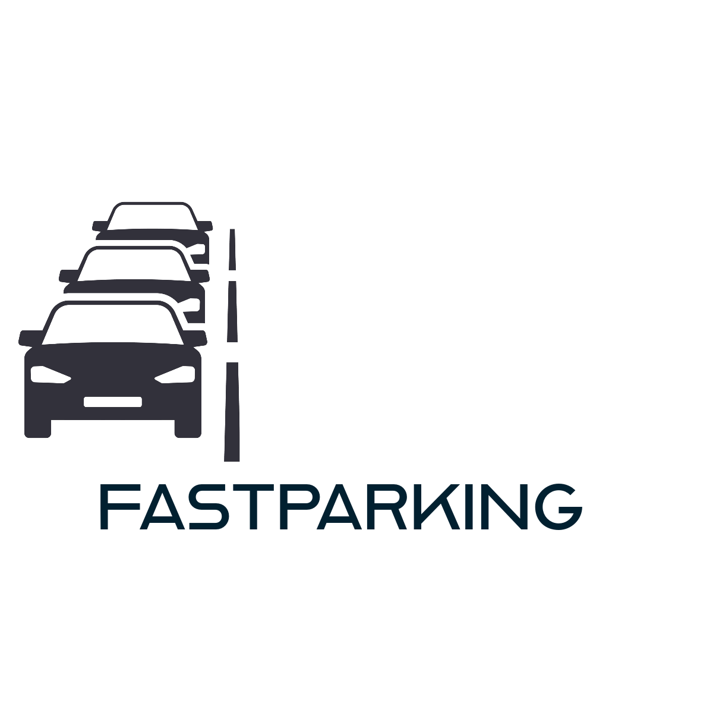
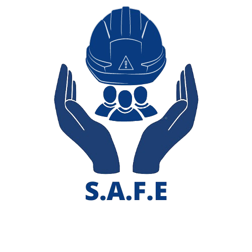

<h1 align="center">Hi 👋, I'm fdsaf</h1>

## 👋 Sobre mim

Sou um desenvolvedor Full Stack apaixonado por tecnologia, com experiência em desenvolvimento web, automação e DevOps. Gosto de transformar ideias em soluções funcionais com foco em performance e boas práticas.

## 🛠️ Tecnologias e Ferramentas
## My favorite tools and technologies ⚙️

> Tools and technologies that I have worked with and am interested in

<table>
  <tr>
    <td align="center" width="96">
        
       C#
    </td>
    <td align="center" width="96">
      
       Python
    </td>
    <td align="center" width="96">
        
       Javascript
    </td>
    <td align="center" width="96">
        
       C++
    </td>
       <td align="center" width="96">
        
       Django
    </td>
       <td align="center" width="96">
        
       Github
    </td>
          <td align="center" width="96">
        
       Rest API
    </td>
          <td align="center" width="96">
        
       Docker
    </td>
    <td align="center" width="96">
        
       Nginx
    </td>
  </tr>
  <tr>
    <td align="center" width="96">
        
       Git
    </td>
    <td align="center"  width="96">
        
       GitLab
    </td>
    <td align="center"  width="96">
        
       HTML
    </td>
    <td align="center" width="96">
        
       CSS
    </td>
    <td align="center"  width="96">
        
       Bootstrap
    </td>
    <td align="center" width="96">
        
       Tailwind
    </td>
        <td align="center" width="96">
        
       JQuery
    </td>
        <td align="center" width="96">
        
       PostgreSQL
    </td>
            <td align="center" width="96">
        
       ASP.NET
    </td>
  </tr>
   <tr>
    <td align="center" width="96">
        
       Redis
    </td>
        <td align="center" width="96">
        
       Postman
    </td>
            <td align="center" width="96">
        
       Linux
    </td>
    <td align="center" width="96">
        
       Dart
    </td>
    <td align="center" width="96">
        
       RabbitMQ
    </td>
    <td align="center" width="96">
        
       sentry
    </td>
    <td align="center" width="96">
        
       Celery
    </td>
    <td align="center" width="96">
        
       Docusaurus
    </td>
    <td align="center" width="96">
        
       Pytest
    </td>
  </tr>
 <tr>
 </tr>
</table>

## 🚀 Projetos em Destaque

- [🔗 MeuPortfólio](https://github.com/ItsNotNatan/meuportfolio): Um site pessoal responsivo construído com React e Tailwind CSS.
- [💬 ChatApp](https://github.com/ItsNotNatan/chatapp): Aplicativo de chat em tempo real usando Socket.io e Node.js.
- [📊 Dashboard DevOps](https://github.com/ItsNotNatan/devops-dashboard): Painel de monitoramento para pipelines de CI/CD usando Prometheus e Grafana.

## 📊 Estatísticas do GitHub

## 📚 Certificações e Cursos

- [Alura] Formação JavaScript Full Stack (2024)
- [Rocketseat] Discover + Explorer (2023)
- [AWS] Fundamentos de Cloud AWS (em andamento)

## ✨ Curiosidades

- 🔍 Gosto de resolver desafios no HackerRank e Codewars
- 📖 Estudo sobre clean code e arquitetura de software
- 🎮 Curto jogos cooperativos e desenvolvimento de games

## 📈 Minhas Estatísticas

## 🧠 Linguagens mais usadas

<!--START_SECTION:activity-->
<!--END_SECTION:activity-->

## 🎯 Objetivo Profissional

Busco oportunidades como desenvolvedor backend ou DevOps, onde eu possa aplicar meus conhecimentos em automação, APIs e infraestrutura como código.

## 🌱 Atualmente estou estudando

- Docker e Kubernetes
- Arquitetura de microsserviços
- AWS com foco em DevOps

### 💻 Projeto: Meu Portfólio

Descrição: Site pessoal com design responsivo, construído com React e Tailwind CSS.

[LinkedIn](https://www.linkedin.com/in/natan-guimar%C3%A3es-dos-santos-231799268/)

  
  
  

## Oiii eu sou a Rafaella Ballerini, criadora de conteúdo de programação e tecnologia!

Pessoal que veio atrás do **Github Stats:** a API provavelmente saiu do ar nesse período,
mas você pode adicionar a sua própria, seguindo esse [tutorial](https://github.com/anuraghazra/github-readme-stats/blob/master/readme.md#deploy-on-your-own-vercel-instance)

 
  
  
  
  
  
  
  

  
  ##
 

 
  
  
 	
  
  
   
  

## Meus projetos

